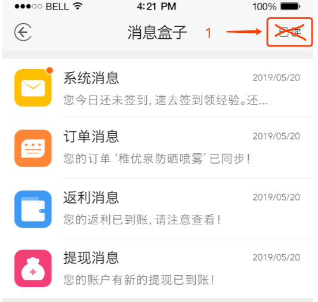

# 跳转 19/06/26
- 首页轮播、底下5个分类、9.9包邮下面的3个活动模块  注：跳转(具体看api)

#### 针对跳转类型4(外部链接)

- 捕捉地址 ：  
        - detail.[m.]*tmall.  (有点)，淘宝天猫  
        - item.taobao.    淘宝天猫  
        - h5.m.taobao.com/awp/core/detail.htm   
        - www.taobao.com/market/ju/detail_wap.php （没用正则，规则不清楚）聚划算  

- 匹配id        id=[0-9]{8,15}、聚划算捕捉id：item_id=[0-9]{8,15} 用前面那个也行，8，15只是做一个模糊位数判断

具体看你的实际操作

# 消息盒子

- 注：顺序固定（后台按序返回），没有接收过相关消息的一整条不展示
- 系统消息(新用户注册、系统消息、签到消息、等级提升、激活高级权益)
    - 用户注册：跳“我的经验”页面
    - 系统消息(1001-一句话)：跳系统消息详情（就是把消息内容在新页面展示出来，时间+内容，虽然跟列表信息一致，但为了统一都能跳转）
    - 签到：签到页面
    - 等级提升(1012、1013、1014)：初、中、高，未激活vip的进入vip黄色背景权益页面，已经成为vip的进入黑色背景权益页面
- 订单消息(列表页面展示同UI“返利消息)
    - 点击列表进入“我的订单”页面，不用管该订单属于哪一种类型，进入“全部”
- 返利消息(列表页面展示同UI“返利消息)
    - 点击列表进入“我的钱包”
- 提现消息(列表页面展示同UI“返利消息)
    - 点击列表进入“提现记录”

